# Linear Algebra Review

## 1. Matrices and Vectors

### 1a. Matrices
- Rectangular array of numbers
- 2D array
- Number of **Rows** x Number of **Columns**
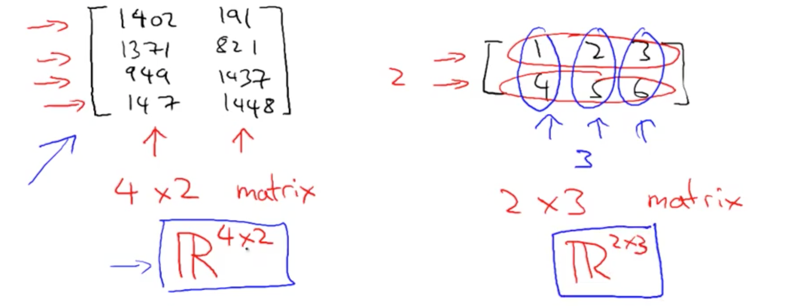

### 1b. Vector 
- n x 1 matrix
- y(i): i-th element
- 1-indexed (start from 1-th)
    - Normally this
- 0-indexed (start from 0-th)
    - Used in Machine Learning

## 2. Addition and Scalar Multiplication

### 2a. Addition
- You can only add matrices with the same dimensions (r x c)
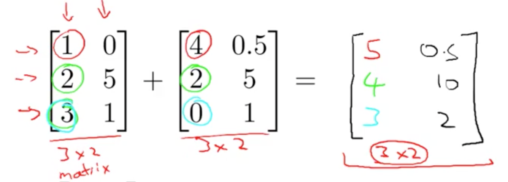

### 2b. Scalar (Number) Multiplication
- Example
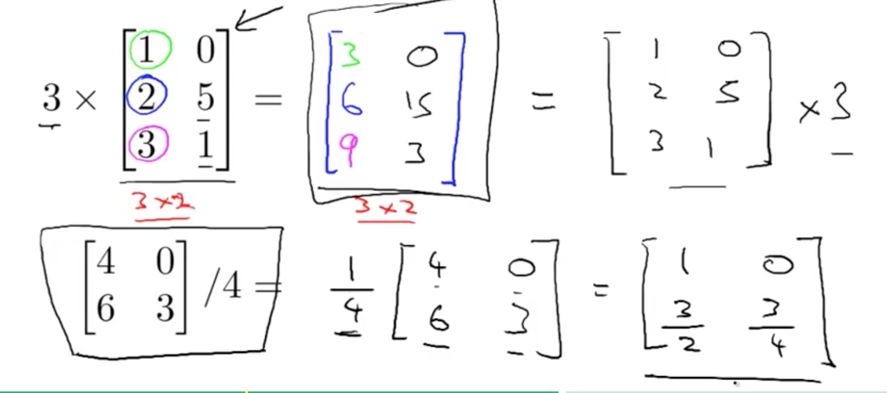

## 3. Matrix Vector Multiplication
- Example
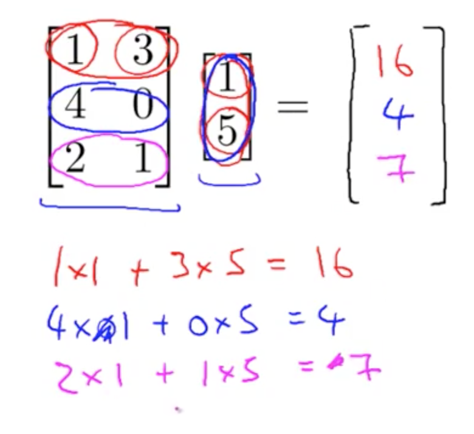
- Theory
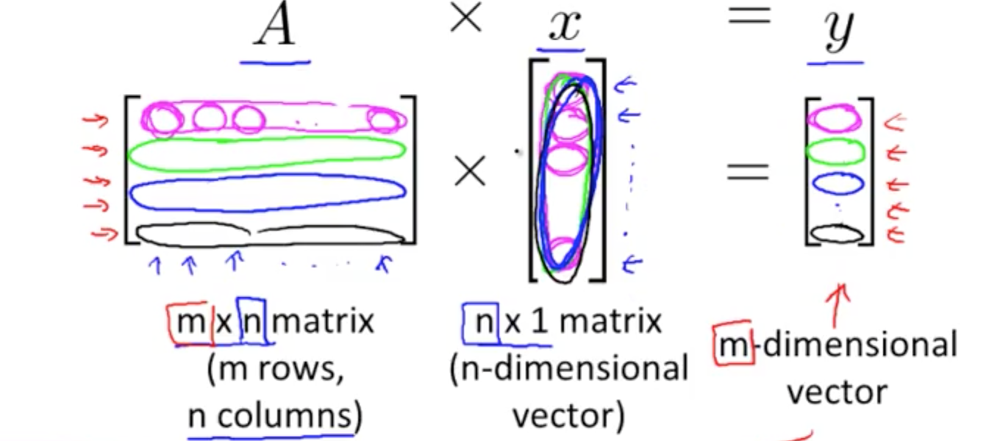
- Application to hypothesis by converting given data to matrix
- prediction = data_matrix x parameters
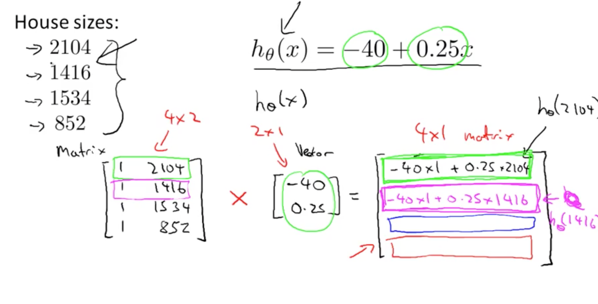

## 4. Matrix Matrix Multiplication
- Example
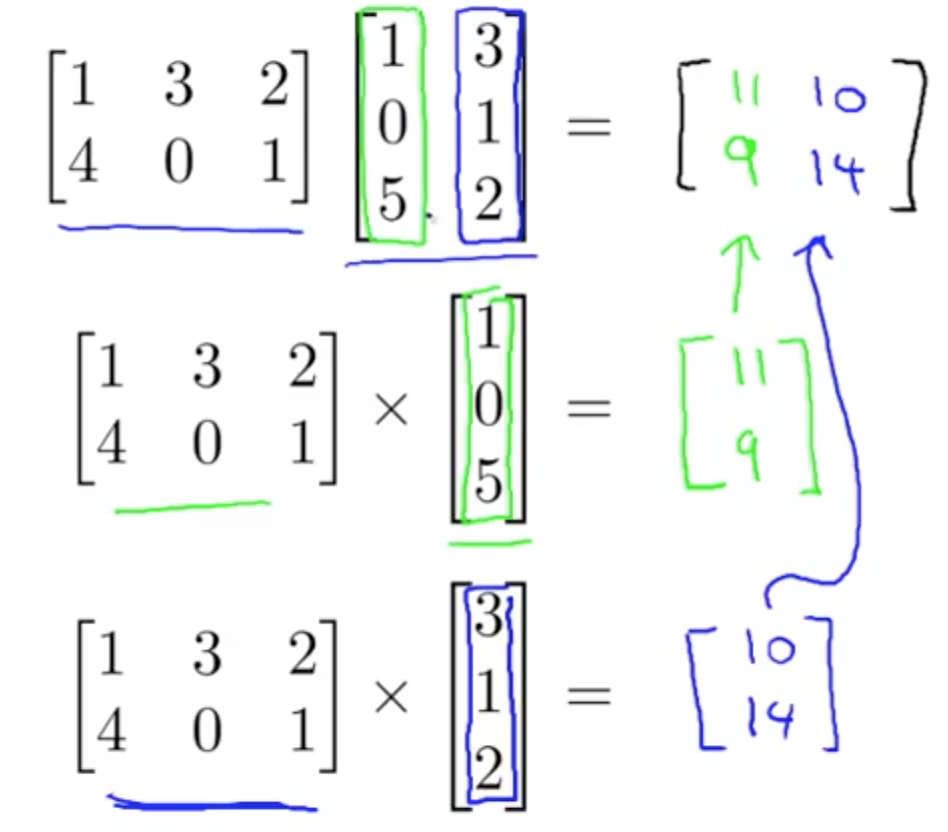
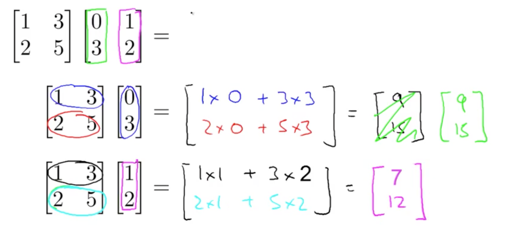
- Theory 
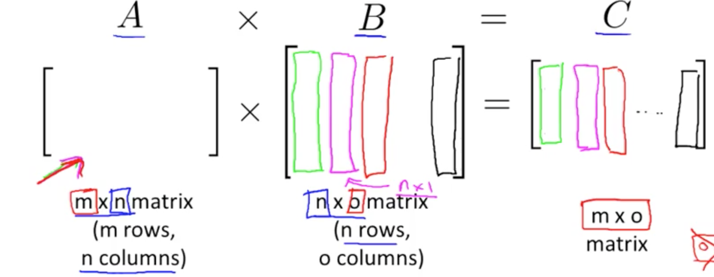
- Application to hypothesis by converting given data to matrix
    - There are linear algebra libraries to do these calculations
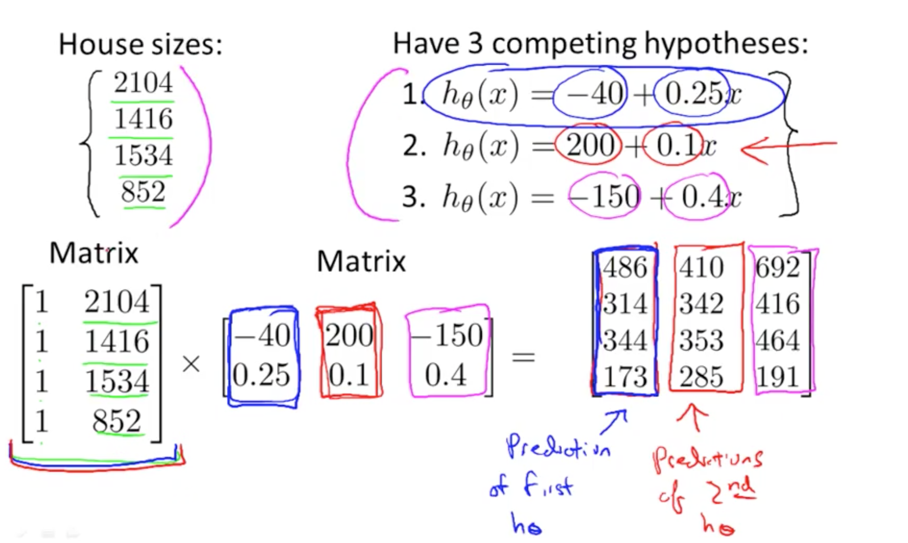

## 5. Properties of Matrix Multiplication

### 5a. Commutative Property
- Not commutative
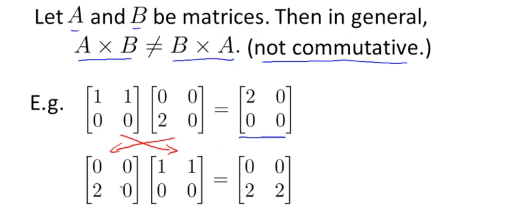

- Associative
    - A x B x C = (A x B) x C = A x (B x C)

- Identity Matrix
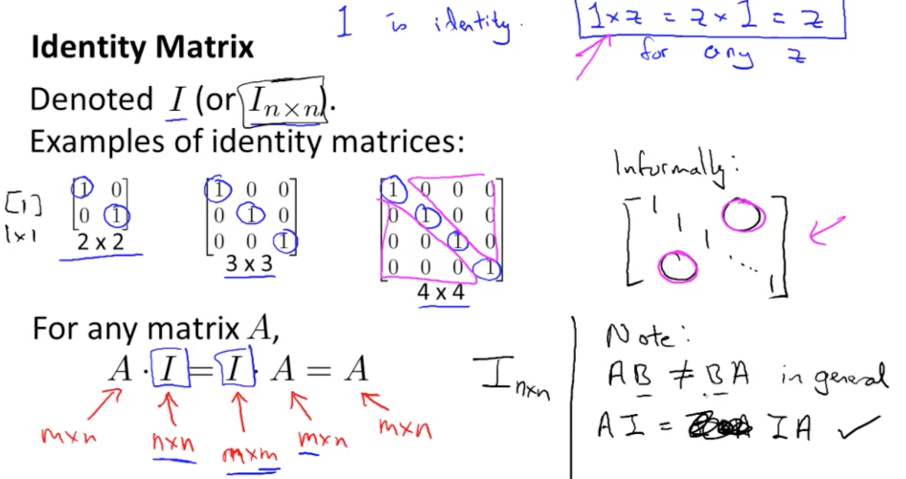

## 6. Inverse and Transpose

### 6a. Inverse
- A * A_inverse = Identity Matrix
- A_inverse = pinv(A) 
    - You can use octave code pinv(A)
- Matrices without inverse --> singular or degenerate
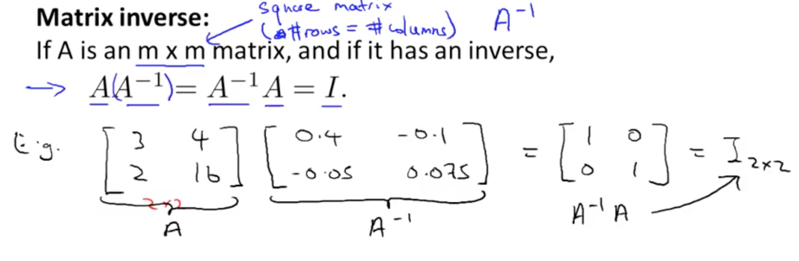

### 6b. Transpose
- Example and theory
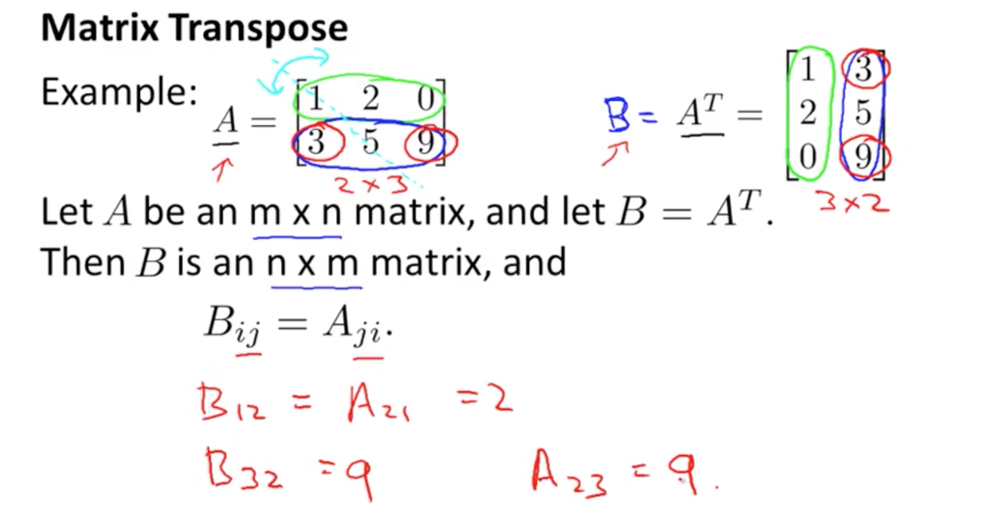

