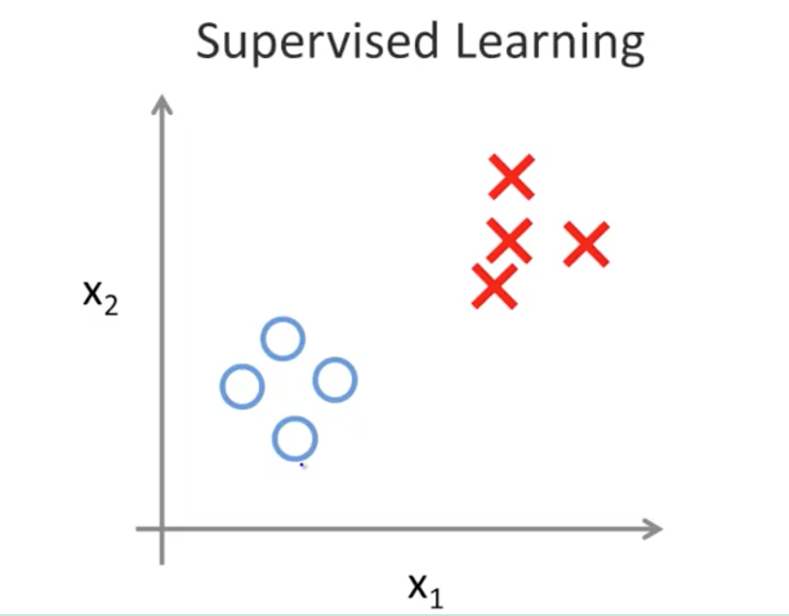
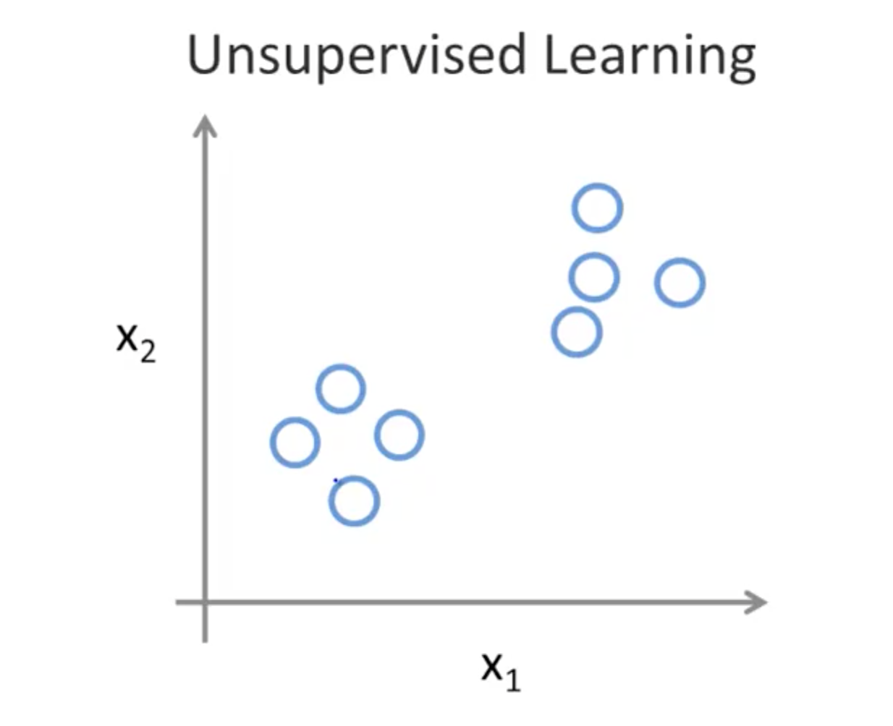

# Introduction to Machine Learning: Supervised and Unsupervised Learning

## Examples of ML
- Database Mining
- Applications that can't program by hand
    - Handwriting recognition
    - NLP
- Self-customising programs
    - Amazon
    - Netflix recommendation systems
- Understand human learning
    - Brain
    - Real AI

## 1. [Supervised Learning](supervised.png)

- Gave data set answers
- Regression: predict continuous valued output

### 1a. Classification
- Discrete valued output (0 or 1)
- Example: Breast cancer (malignant and benign)
    1. Tumor size
    2. Age
        - Classify 2 clusters to determine which is more likely

### 1c. Problem 1 (Regression Problem)
You have a large inventory of identical items. You want to predict how many
of these items will sell within the next 3 months.
    10000 items (continuous value)

### 1d. Problem 2 (Classification Problem)
You'd like a software to examine individual accounts and decide, for each account,
if it has been hacked/compromised.
    0: not hacked
    1: hacked

## 2. [Unsupervised Learning](unsupervised.png) 

- Making sense of data; patterns we don't know in advance
- Examples
    - Social network analysis
    - Market segmentation
    - Astronomical data analysis

### 2a. Cocktail Party Problem
- Give 2 audio recording
- Feed to unsupervised learning algorithm
- Find structure
    - Separate audio sources

### Unsupervised Learning Problems
    1. Given a set of news articles found on the web, group them into set of articles about
       the same story
    2. Given a database of customer data, automatically discover market segments and group
       customers into different market segments

## 3. Model and Cost Function

### Model Representation
- Supervised learning: given the right answer for each example in the data
- Regression: predict real-valued output
- Classification: predict discrete-valued output
- Training set: original data
    - m = number of training examples
    - x = input variable/features
    - y = output variable/target
    - (x, y) = one training example
    - (x^(i), y^(i)) = i-th training example

