# Linear Regression with Multiple Variables

## 1. Multivariate Linear Regression

### 1a. Multiple Features (Variables)
- X1, X2, X3, X4 and more
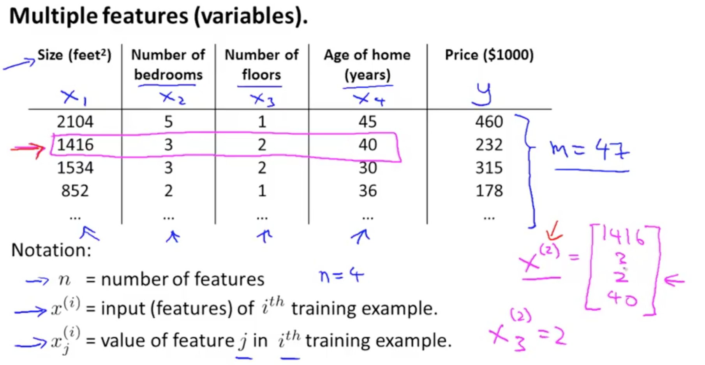
- New hypothesis

- Multivariate linear regression 
    - Can reduce hypothesis to single number with a transposed theta matrix multiplied by x matrix

### 1b. Gradient Descent for Multiple Variables
- Summary
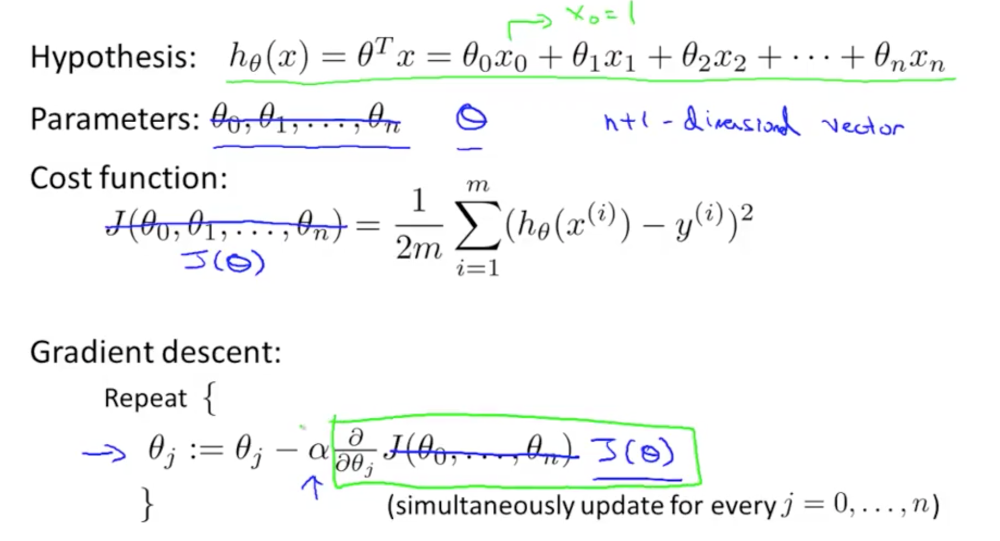

- New Algorithm
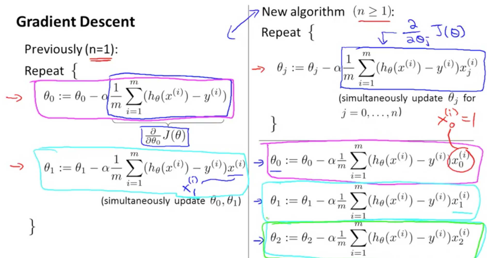

### 1c. Gradient Descent: Feature Scaling
- Ensure features are on similar scale
    - Gradient descent will take longer to reach the global minimum when the features are not on a similar scale
    - Feature scaling allows you to reach the global minimum faster
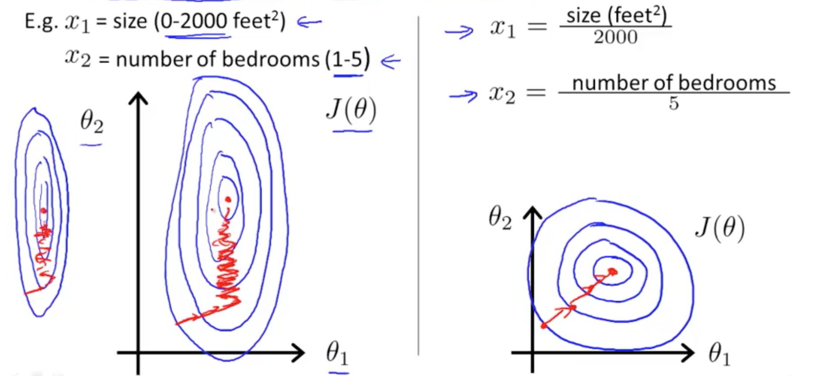
- So long they're close enough, need not be between 1 and -1
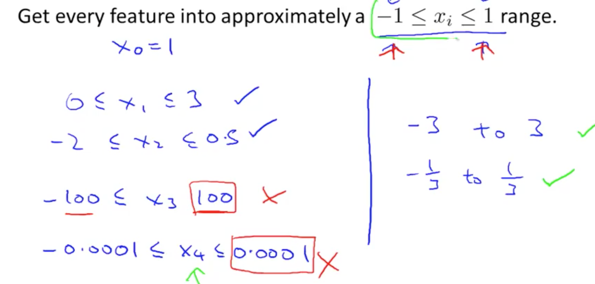
- Mean normalization 

### 1d. Gradient Descent: Checking 
- Can you a graph
    - x-axis: number of iterations
    - y-axis: min J(theta)
- Or use automatic convergence test
    - Tough to gauge epsilon
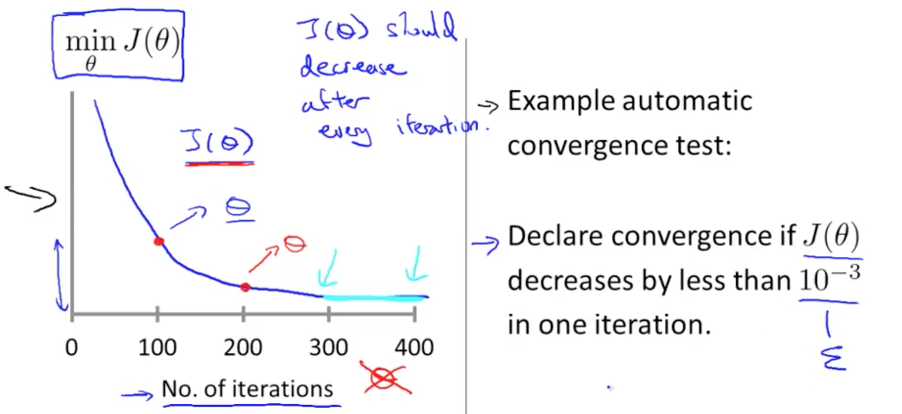
- Gradient descent that is not working (large learning rate)
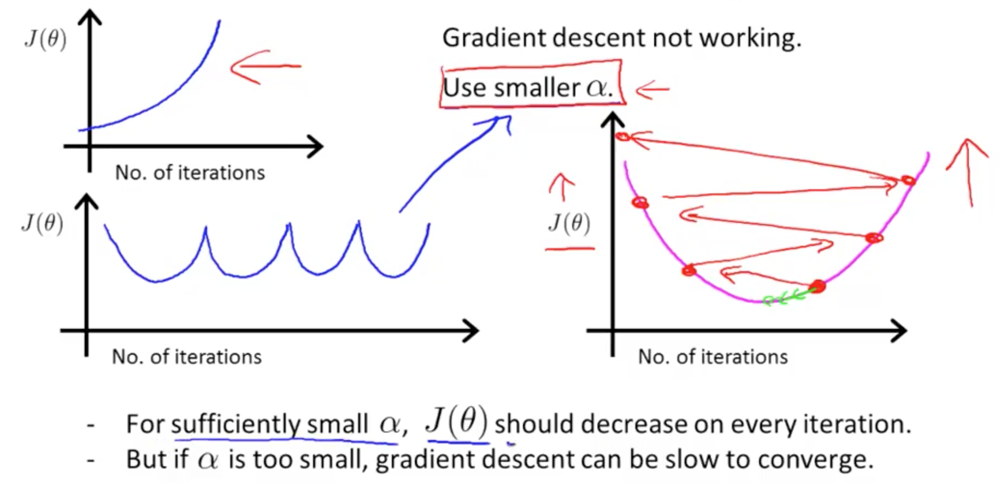

### 1e. Gradient Descent: Learning Rate 
- Alpha (Learning Rate) too small: slow convergence
- Alpha (Learning Rate) too large: 
    - J(theta) may not decrease on every iteration
    - May not converge (diverge)
- Start with 0.001 and increase x3 each time until you reach an acceptable alpha
    - Choose a slightly smaller number than that acceptable alpha value
    
### 1f. Features and Polynomial Regression
- Ensure the features capture the pattern
    - Doesn't make sense to choose quadratic equation for house prices
    - Use cubic or square root
- There are automatic algorithms, and this will be discussed later
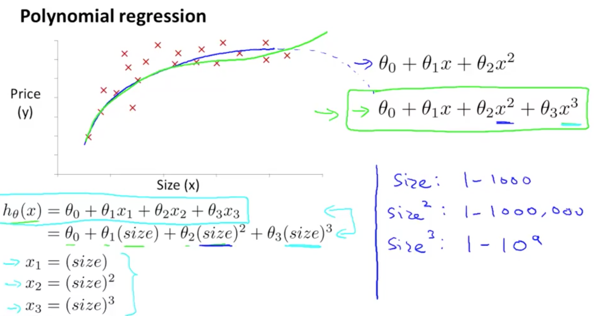
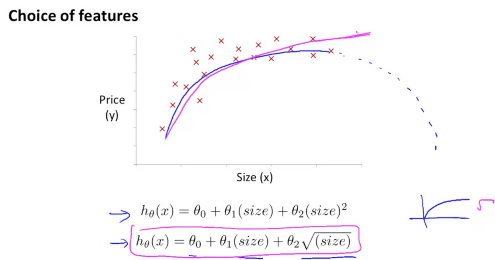

    
## 2. Computing Parameters Analytically

### 2a. Normal Equation
- Method to solve for theta analytically
- If theta is real number
    - Minimise J(theta) is to take the derivative and equate to zero
    - Solve for theta
- If theta is not
    - Take partial derivative and equate to zero
    - Solve for all thetas
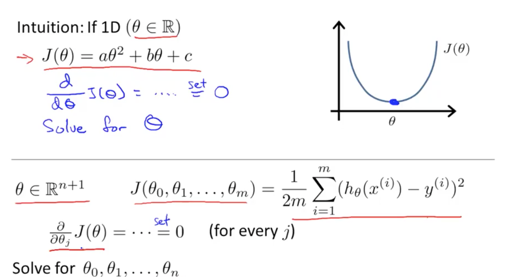
- Minimise Cost Function: Specific Example
    - X: m x (n + 1)
        - m: number of training examples
        - n: number of features
    - X_transpose: (n + 1) x m
    - X_transpose * X:  (n + 1) x m * m x (n + 1) = (n + 1) x (n + 1)
    - (X_transpose * X)^-1 * X_transpose: (n + 1) x (n + 1) * (n + 1) x m = (n + 1) x m
    - theta = (n + 1) x m * m x 1 = (n + 1) x 1
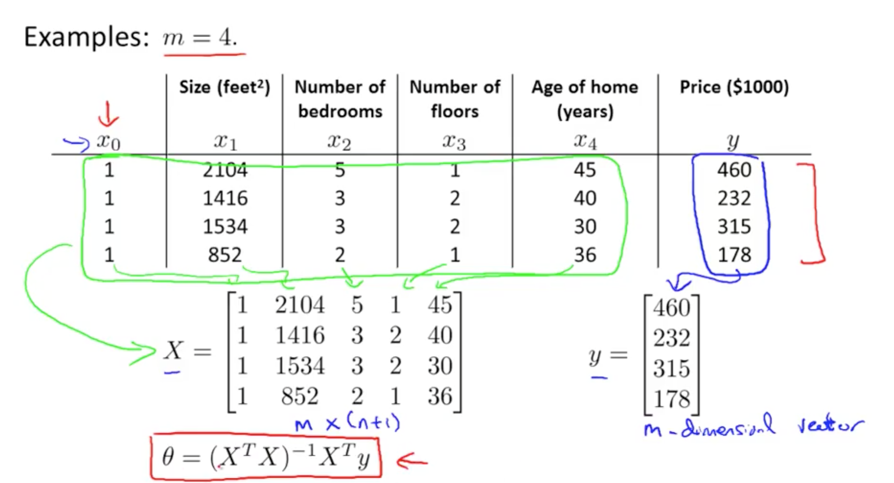
- Minimise Cost Function: General
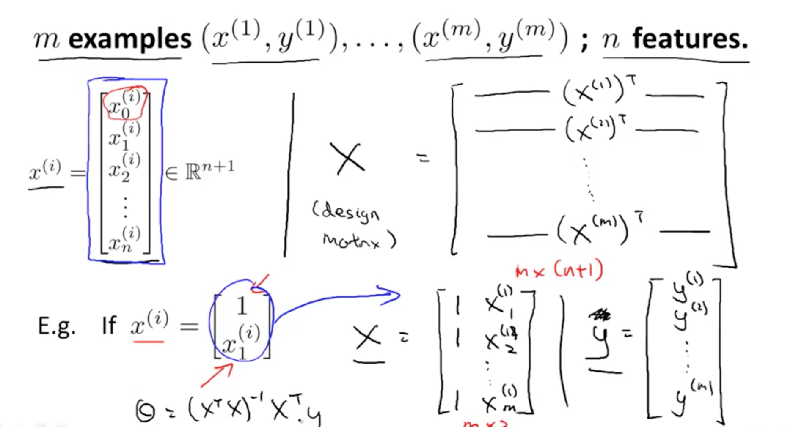
- Minimise Cost: Octave Code
    - No need for feature scaling using normal equation
    - ``pinv (X' * X) * X' * y``
- Gradient Descent vs Normal Equation

| Gradient Descent        | Normal Equation           |
| ------------- |:-------------:|
| Need to choose alpha     | No need to choose alpha |
| Needs many iterations      | Don't need to iterate      |
| Works with large n (10,000)| Slow if n is large (100, 1000 is fine)      |
| Number of features > 1000 | So long number features < 1000      |

### 2b. Normal Equation Non-invertibility 
- What happens if X_transpose * X is non-invertible (singular or degenerate)
    - ``pinv (X' * X) * X' * y``
    - This works regardless if it is non-invertible
- Intuition of non-invertibility 
    - Causes of non-invertibility
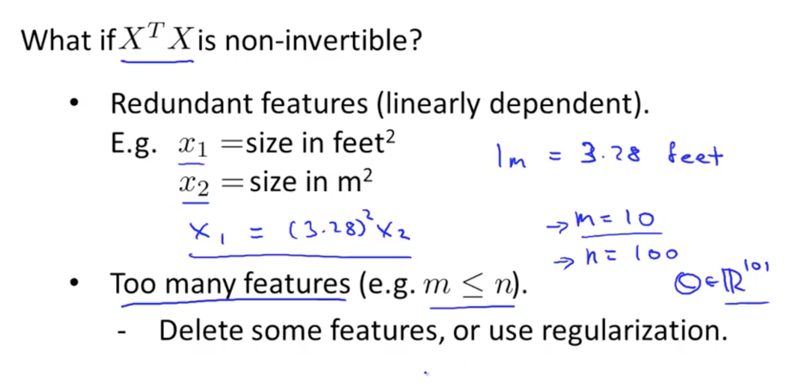
    - Delete redundant features to solve non-invertibility problem
    - Delete some features or use regularization

