# Logistic Regression

## 1. Classification and Representation

### 1a. Classification
- y variable (binary classification)
    - 0: negative class
    - 1: positive class 
- Examples
    - Email: spam / not spam
    - Online transactions: fraudulent / not fraudulent
    - Tumor: malignant / not malignant
- Issue 1 of Linear Regression
    - As you can see on the graph, your prediction would leave out malignant tumors as the gradient becomes less steep with an additional data point on the extreme right
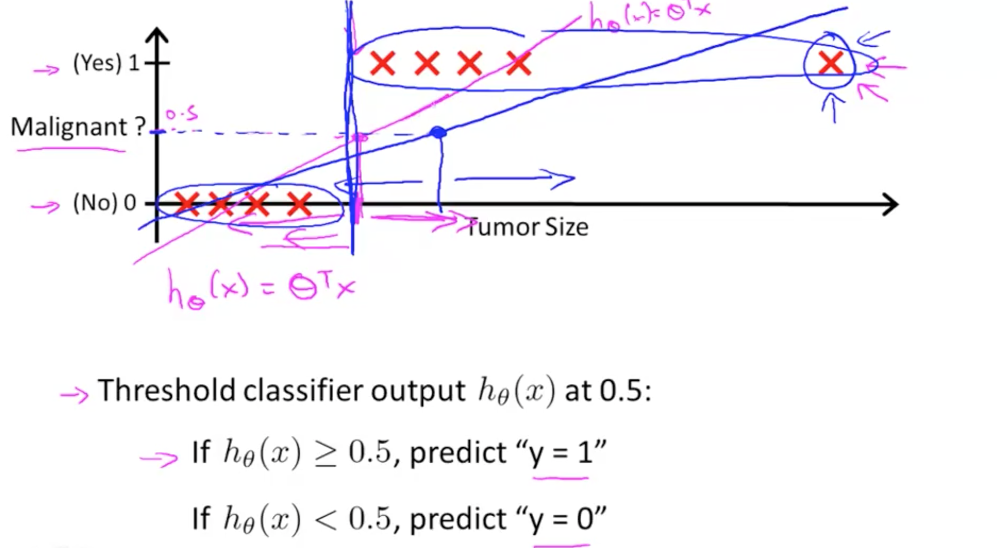
- Issue 2 of Linear Regression
    - Hypothesis can be larger than 1 or smaller than zero
    - Hence, we have to use logistic regression

## 1b. Logistic Regression Hypothesis
- Logistic Regression Model

- Interpretation of Hypothesis Output
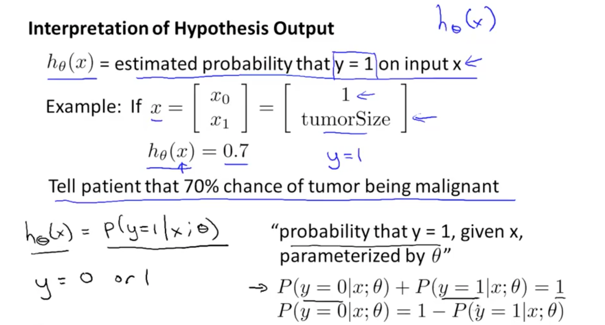

## 1c. Decision Boundary
- Boundaries
    - Max 1
    - Min 0
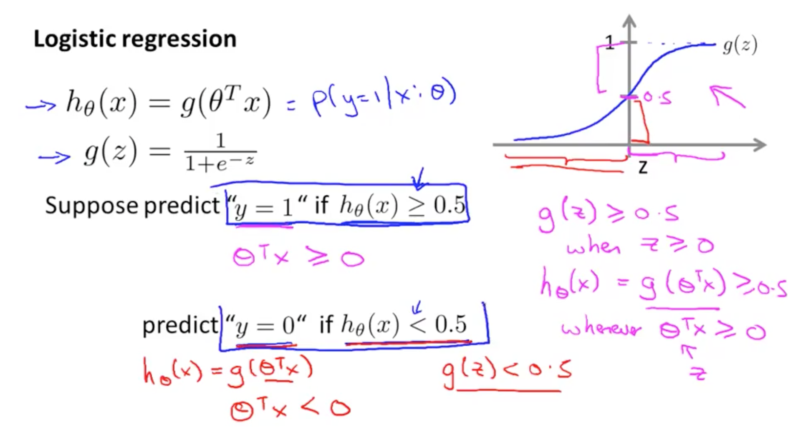
- Boundaries are properties of the hypothesis not the data set
    - You do not need to plot the data set to get the boundaries
    - This will be discussed subsequently
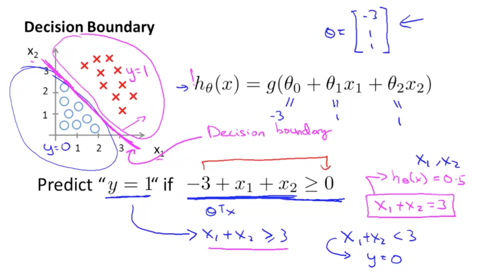
- Non-linear decision boundaries
    - Add higher order polynomial terms as features
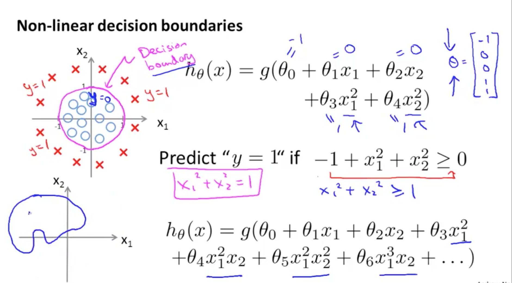

## 2. Logistic Regression Model

### 2a. Cost Function
- How do we choose parameters?
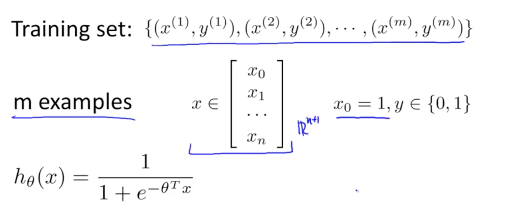
- If y = 1
    - If h(x) = 0 & y = 1, costs infinite
    - If h(x) = 1 & y = 1
    , costs = 0
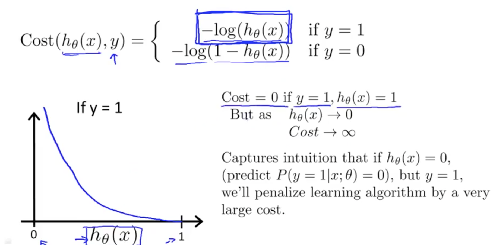
- If y = 0
    - If h(x) = 0 & y = 0, costs = 0
    - If h(x) = 1 & y = 0, costs infinite
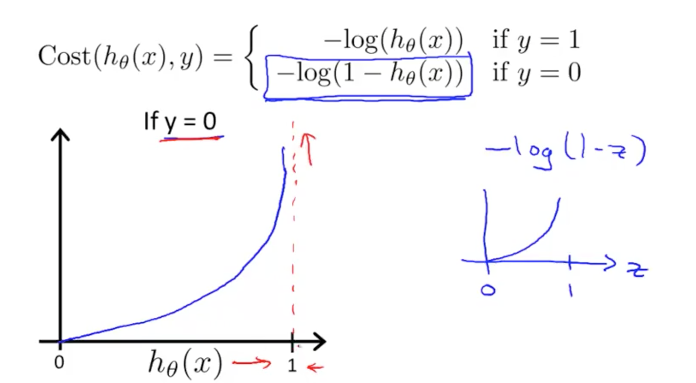

### 2b. Simplified Cost Function & Gradient Descent
- Simplified Cost Function Derivatation
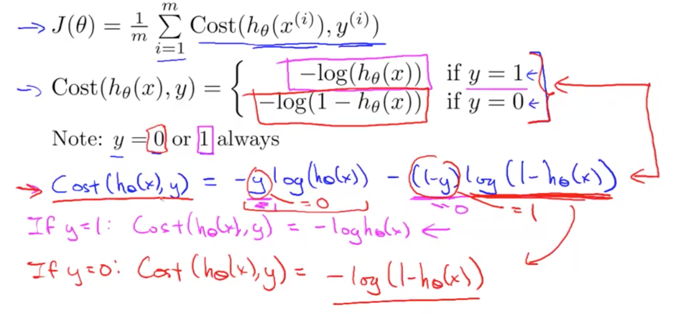
- Simplified Cost Function
    - Always convex so we will reach global minimum all the time
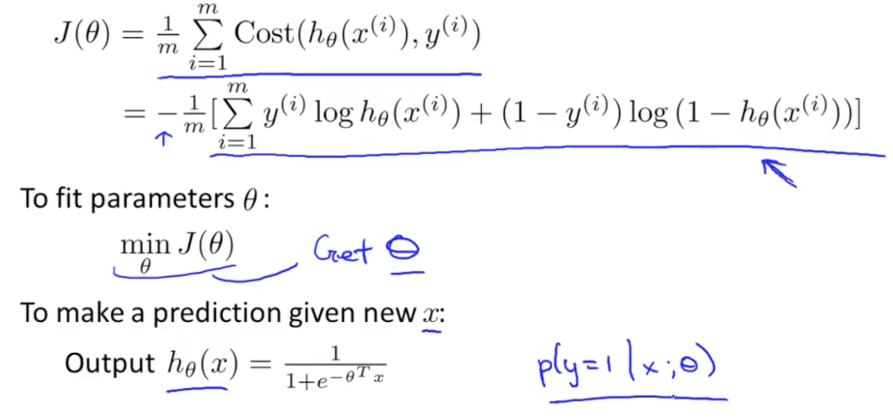
- Gradient Descent
    - It looks identical, but the hypothesis for Logistic Regression is different from Linear Regression

- Ensuring Gradient Descent is Running Correctly
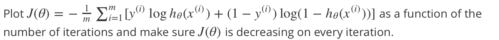

## 2c. Advanced Optimization
- Background

- Optimization algorithm
    - Gradient descent
    - Others
        - Conjugate gradient
        - BFGS
        - L-BFGS
- Advantages "Others"
    - No need to manually pick alpha
    - Often faster than gradient descent
- Disadvantages "Others"
    - More complex
    - Should not implement these yourself unless you're an expert in numerical computing
        - Use a software library to do them
        - There are good and bad implementations, choose wisely

- Components of code explanation 
    - Code
    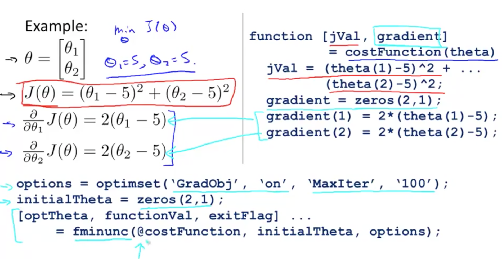
    - 'Gradobj', 'on' 
        - We will be providing gradient to this algorithm
    - 'MaxIter', '100'
        - Max iterations to 100
    - fminunc 
        - Function minimisation unconstrained
        - Cost minimisation function in octave
    - @costFunction
        - Points to our defined function
    - optTheta
        - Automatically choose learning rate
        - Gradient descent on steriods
    - Results
        - Theta0 = 5
        - Theta1 = 5
        - functionVal = 1.5777e-030
            - Essentially 0 for J(theta), what we are hoping for
        - exitFlag = 1 
            - Verify if it has converged, 1 = converged
    - Theta must be more than 2 dimensions
    - Main point is to write a function that returns J(theta) and gradient to apply to logistic or linear regression
        - 

## 3. Multi-class Classification
- Similar terms
    - One-vs-all
    - One-vs-rest
- Examples
    - Email folders or tags (4 classes)
        - Work
        - Friends
        - Family
        - Hobby
    - Medical Diagnosis (3 classes)
        - Not ill
        - Cold
        - Flu
    - Weather (4 classes)
        - Sunny
        - Cloudy
        - Rainy 
        - Snow
- Binary vs Multi-class 
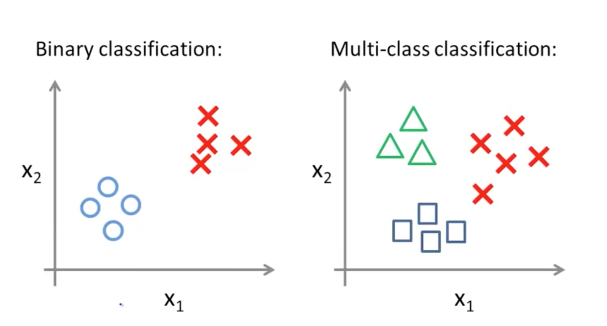
- One-vs-all (One-vs-rest)
    - Split them into 3 distinct groups and compare them to the rest
    - If you have k classes, you need to train k logistic regression classifiers
    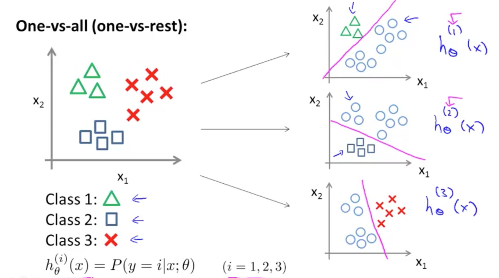
    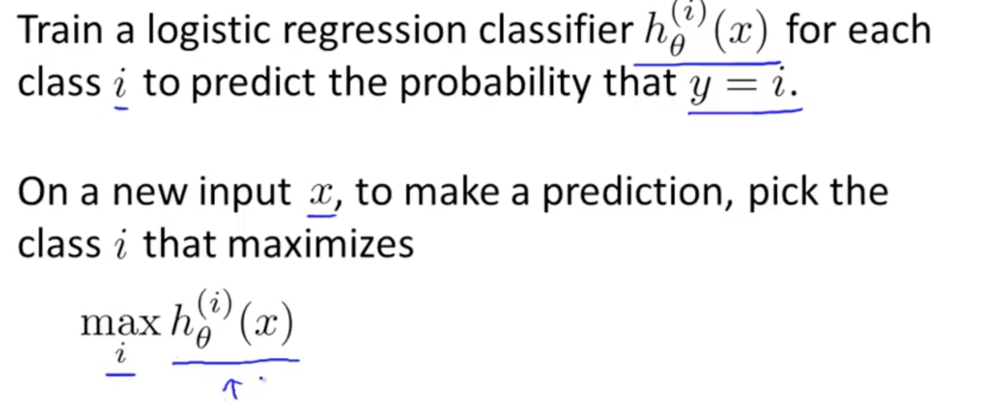
    
## 3. Solving Problem of Overfitting

### 3a. Problem of Overfitting
- Linear Regression: Overfitting
    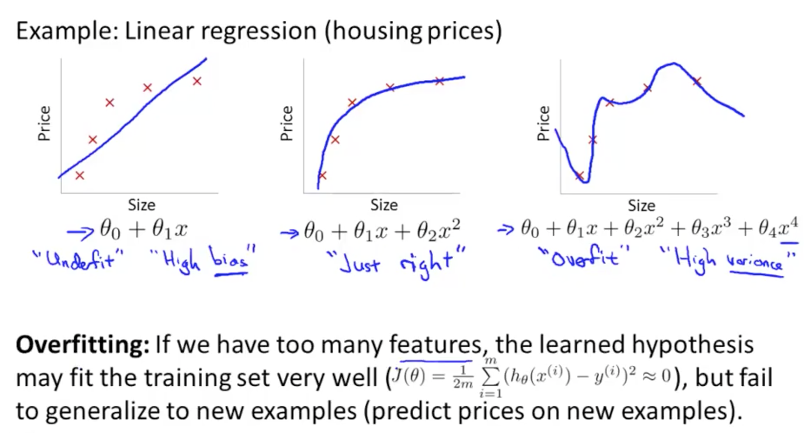
    - Overfit 
        - High Variance
        - Too many features
        - Fit well but fail to generalize new examples
    - Underfit
        - High Bias
- Logistic Regression: Overfitting
    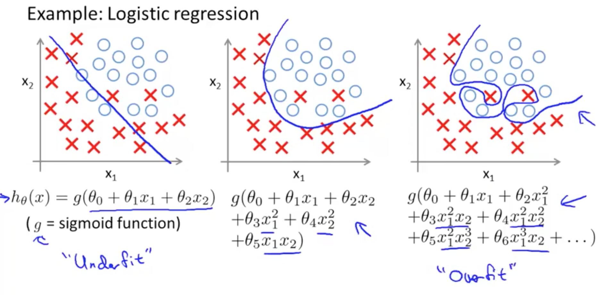
- Solutions to Overfitting
    - Reduce number of features
        - Manually select features to keep
        - Model selection algorithm
    - Regularization
         - Keep all features, but reduce magnitude or values of parameters theta_j
         - Works well when we've a lot of features

### 3b. Cost Function
- Intuition
    - Making theta so small that is almost equivalent to zero
    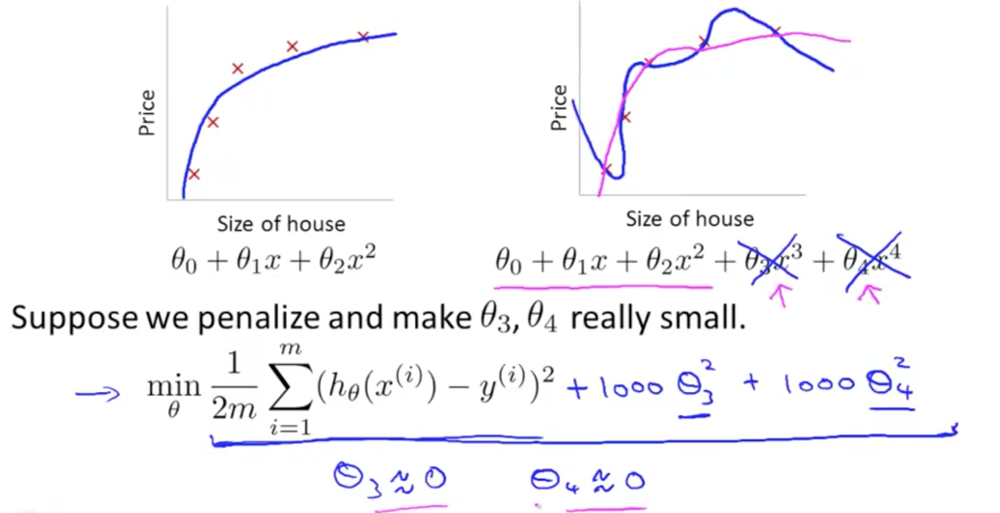
- Regularization
    - Small values for parameters (thetas)
        - "Simpler" hypothesis
        - Less prone to overfitting
    - Add regularization parameter to J(theta) to shrink parameters
        - First goal: fit training set well (first term)
        - Second goal: keep parameter small (second, pink, term)
    - If lamda is set to an extremely large value, this would result in underfitting
        - High bias
    - Only penalize thetas from 1, not from 0
    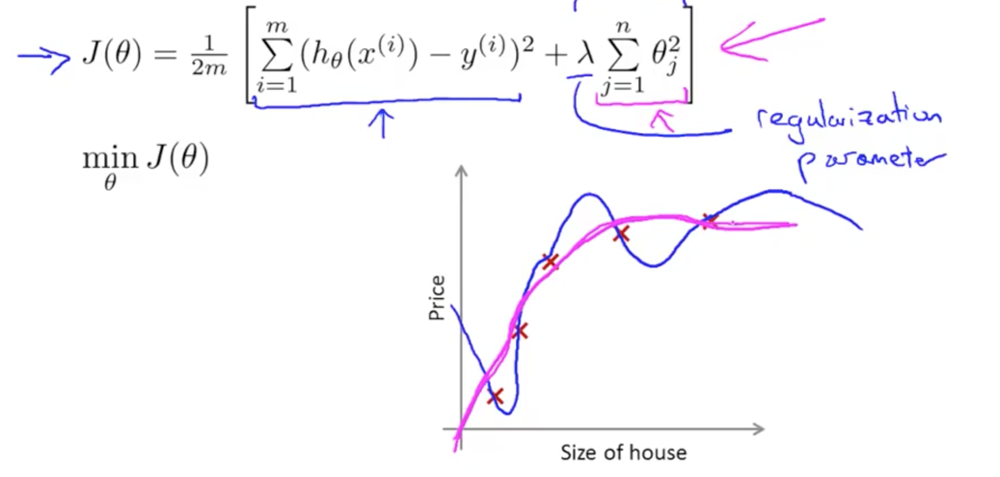
    
    
### 3c. Regularized Linear Regression
- Gradient Descent Equation
    - Usually, (1- alpha * lambda / m) is 0.99
    
- Normal Equation 
    - Alternative to minimise J(theta) only for linear regression
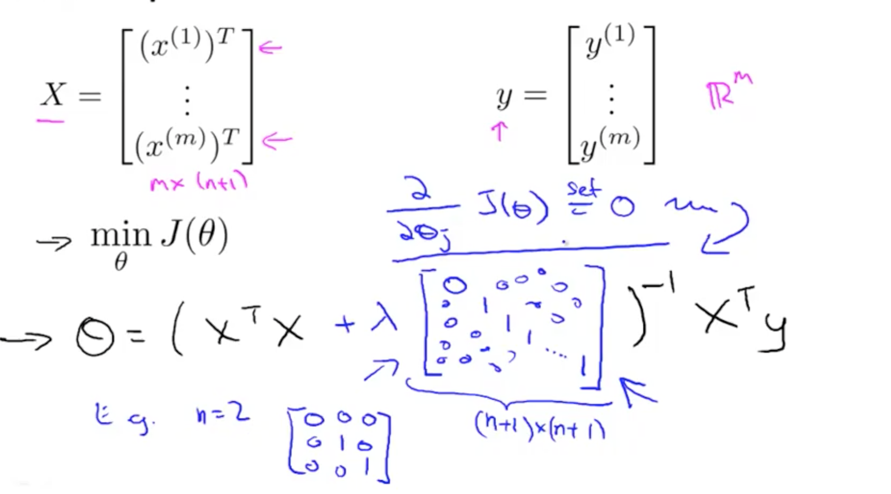
- Non-invertibility
    - Regularization takes care of non-invertibility
    - Matrix will not be singular, it will be invertible
    
### 3c. Regularized Logistic Regression
- Cost function with regularization
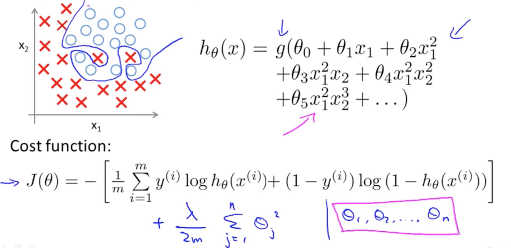
- Using Gradient Descent for Regularized Logistic Regression Cost Function
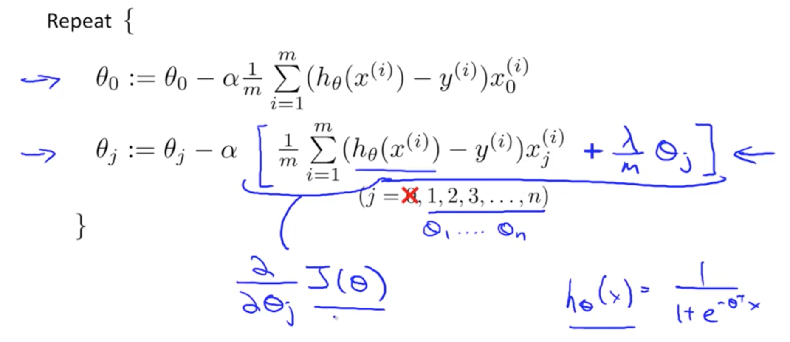
- To check if Gradient Descent is working well
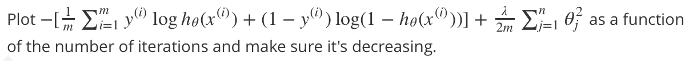
- Using Advanced Optimisation
    - Pass in fminunc in costFunction
    - costFunction need to return
        - jVal
        - gradient
        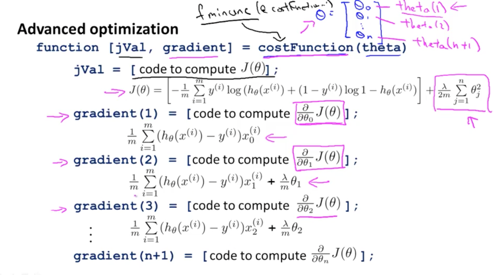
