# Recommender Systems
- This is an important practical application of machine learning
- Netflix, Spotify, Youtube, Amazon and other companies try to recommend things to you

## 1. Predicting Movie Ratings

### 1a. Problem Formulation
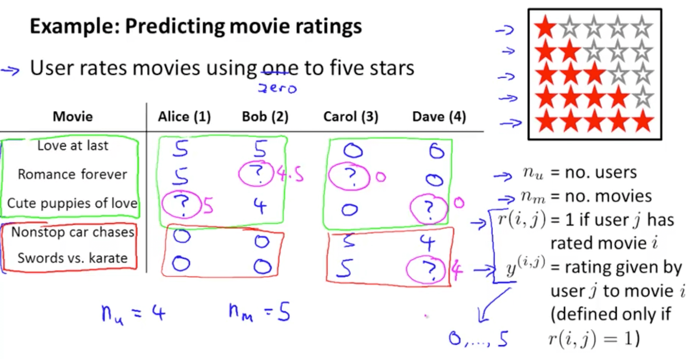

### 1b. Content Based Recommendations
- How do we predict the missing values? 
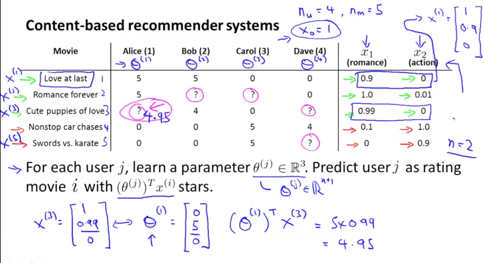
- Problem formulation
    - If we minimize the following function, we get the parameters to predict 
    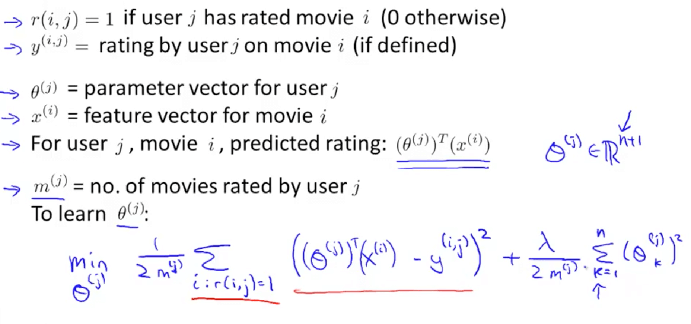
    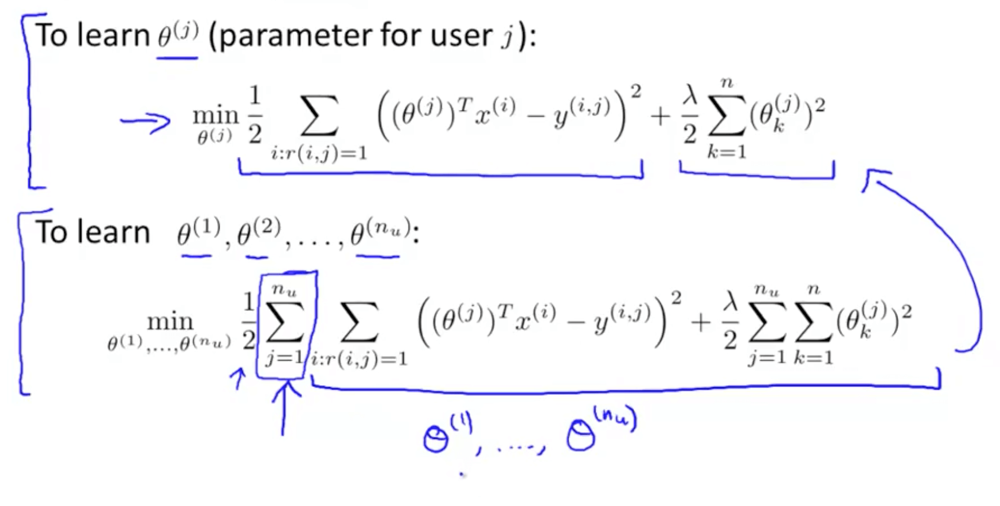
    - We can use other minimization algorithms (other than gradient descent)
    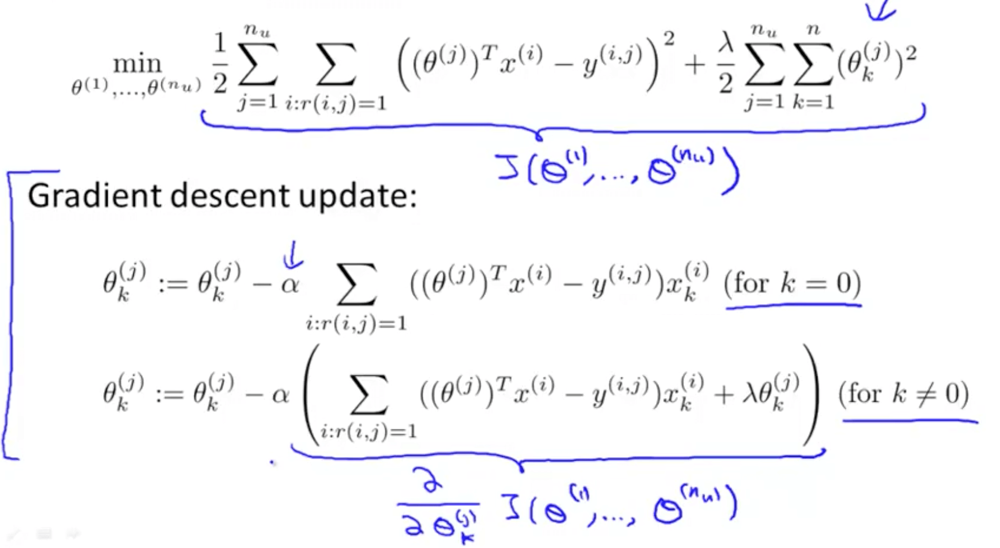

## 2. Collaborative Filtering

### 2a. Introduction
- Here we will be learning about "Feature Learning"
    - Feature Learning: learning what features to use
- Problem motivation
    - It is inefficient and difficult to ask someone to watch each movie and inform us how romantic or action-packed the movie is
    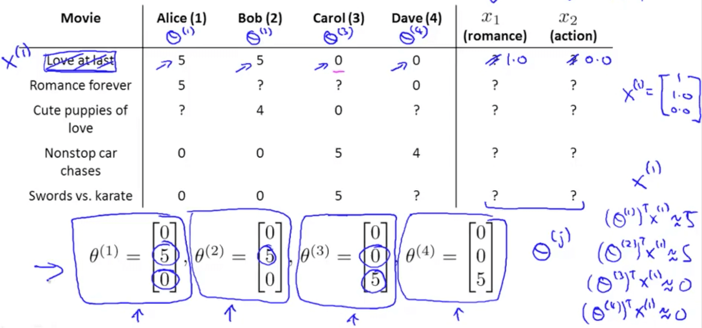
        - Now we've no idea how each movie is romantic (x1) or action-packed (x2)
        - Let's say that
            - Alice (θ1): likes romance
            - Bob (θ2): likes romance
            - Carol (θ3): likes action
            - Dave (θ4): likes action
        - We can discover x_1 by making sure the following happens
            - θ1_transpose * x_1 = 5
            - θ2_transpose * x_1 = 5
            - θ3_transpose * x_1 = 0
            - θ4_transpose * x_1 = 0
- Optimization algorithm
    - This tries to choose features X_i so that for all the users J that have rated that movie, the algorithm also predicts a value for how that user would have rated that movie that is not too far, in the squared error sense, from the actual value that the user had rated that movie
    - Regularization term to prevent features from becoming too big
    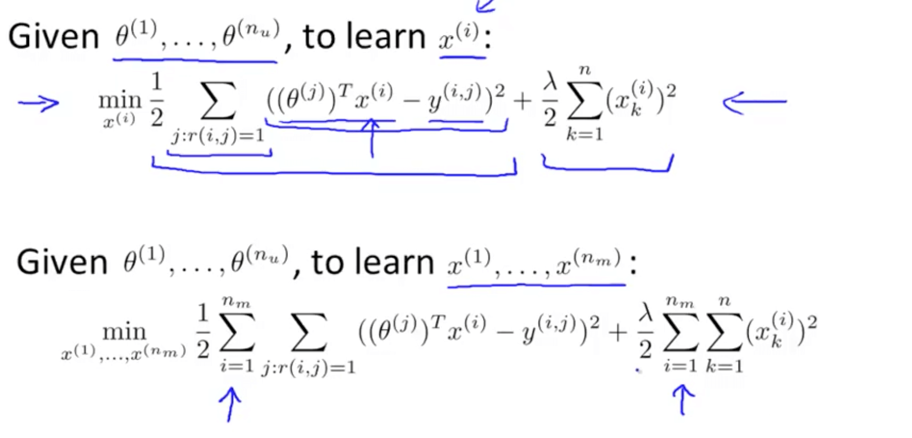
    - We can guess θ, solve for x, then solve for θ and continue
        - There is a more efficient method to do this and we will be discussing this shortly
    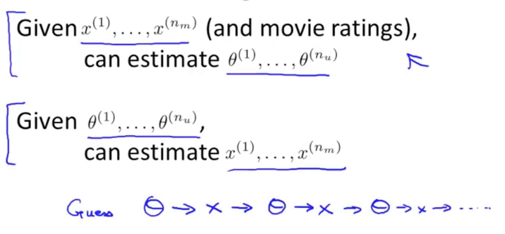
    
### 2b. Collaborative Filtering Algorithm
- Collaborative filtering optimization objective
    - We will take both of these optimization objectives and put them together
    - Now we get to minimize with respect to x and θ simultaneously
    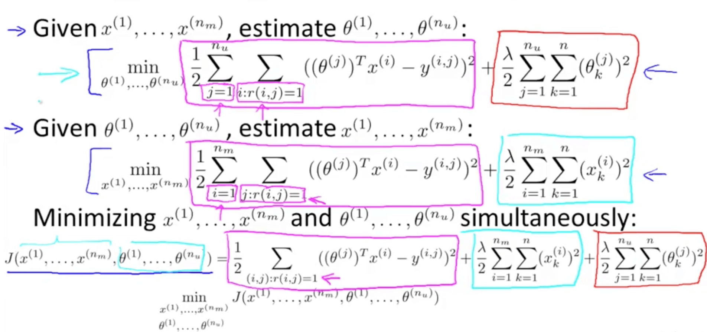
- Collaborative filtering algorithm
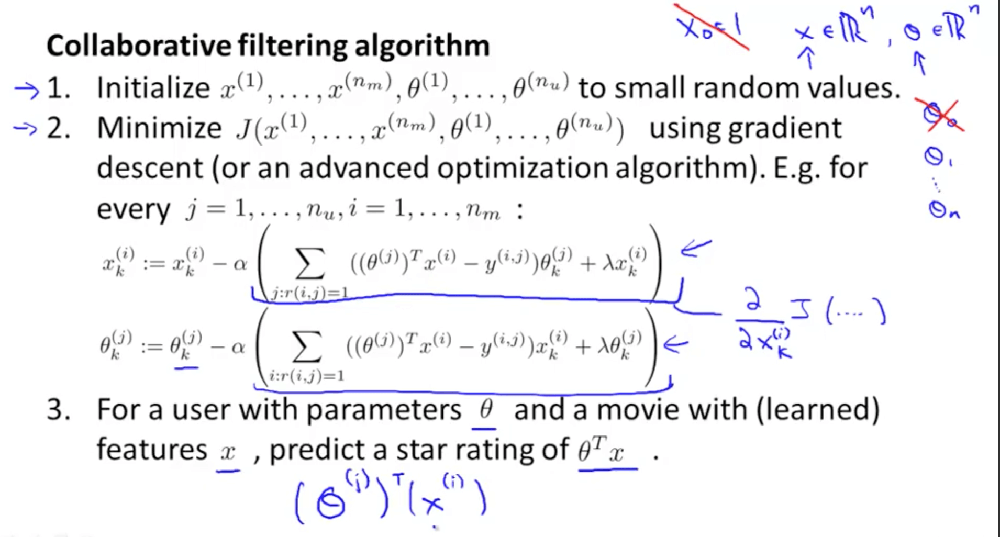

## 3. Low Rank Matrix Factorization

### 3a. Vectorization: Low Rank Matrix Factorization
- Low rank matrix factorization
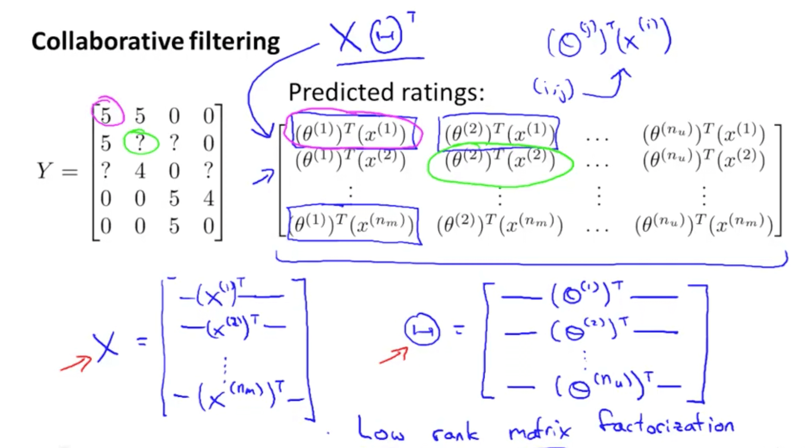
- Finding related movies
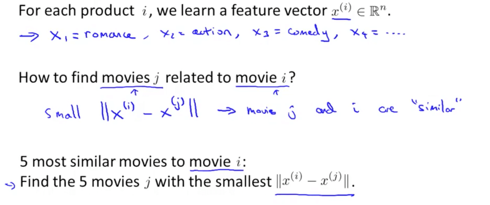

### 3b. Implementation Detail: Mean Normalization
- Issue without mean normalization
    - And for even the Swords vs. Karate, someone rated it 5 stars
    - So some people do like some movies
    - It seems not useful to just predict that Eve is going to rate everything 0 stars
    - If we're predicting that eve is going to rate everything 0 stars, we also don't have any good way of recommending any movies to her, because you know all of these movies are getting exactly the same predicted rating for Eve so there's no one movie with a higher predicted rating that we could recommend to her
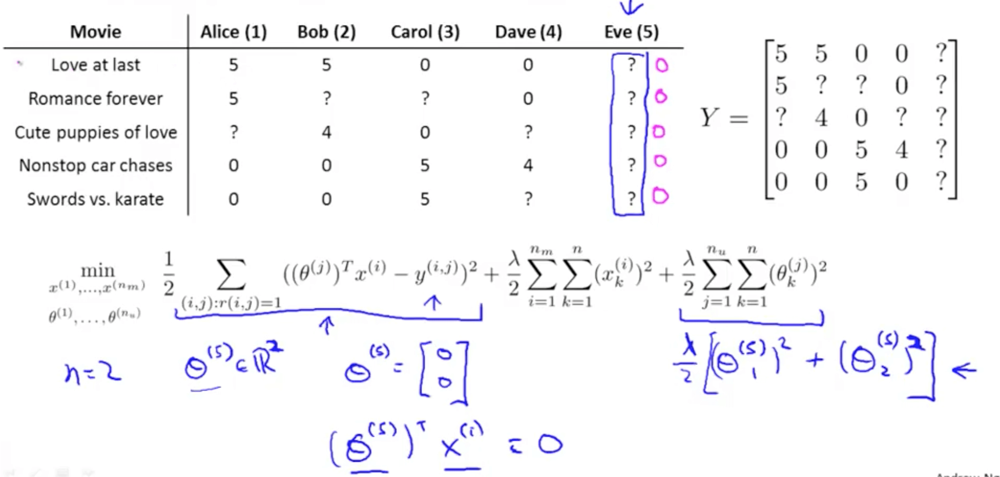
- We can conduct mean normalization to solve this issue
    - Our prediction would be the average of each movie
    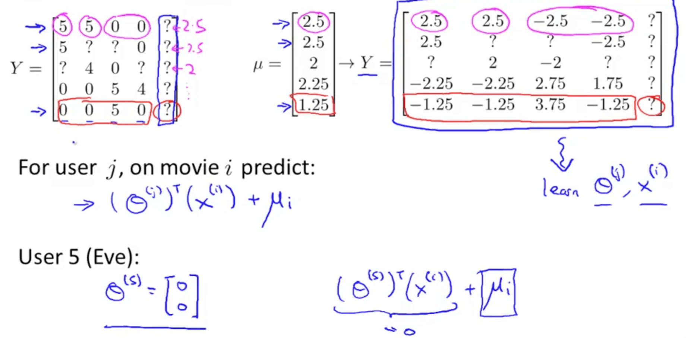

